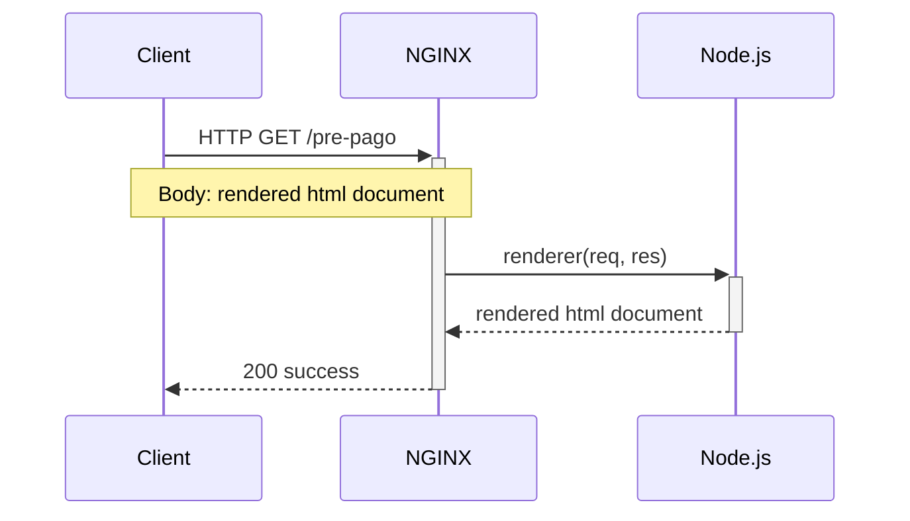

```mermaid
sequenceDiagram
  participant Client
  participant NGINX
  participant Node.js

  Client ->>+ NGINX: HTTP GET /pre-pago
      Note over Client,NGINX: Body: rendered html document
  NGINX ->>+ Node.js: renderer(req, res)
  Node.js -->>- NGINX: rendered html document
  NGINX -->>- Client: 200 success
```
